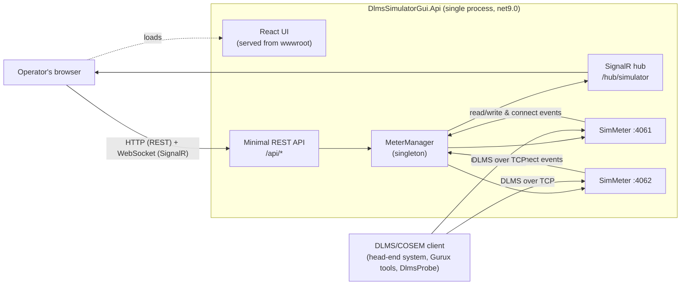
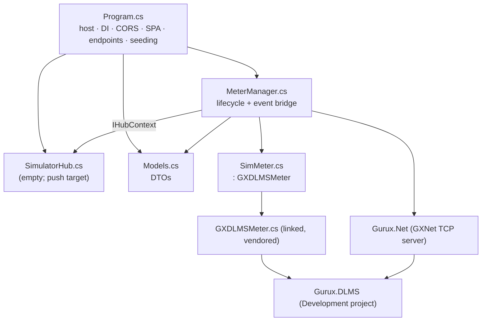
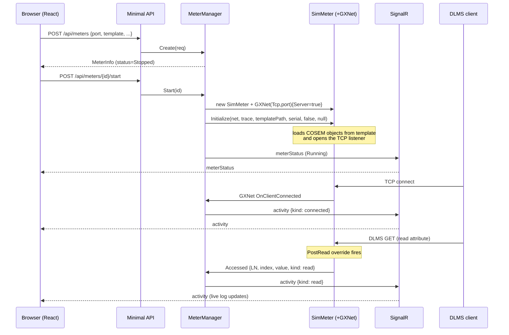
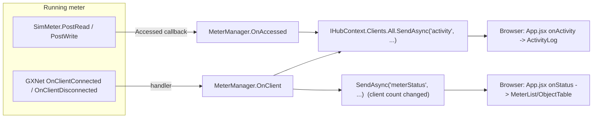
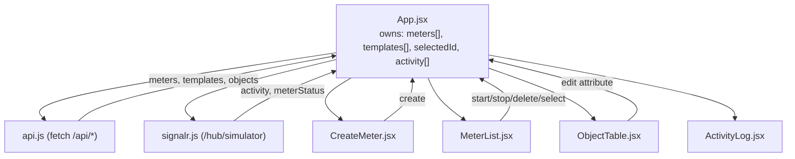
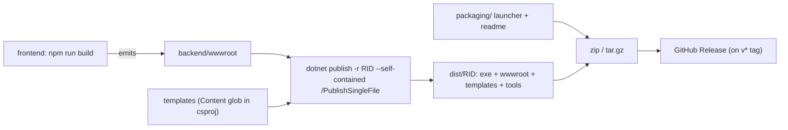

# Architecture

How the DLMS Simulator is put together, and **why**. Diagrams are Mermaid (render
on GitHub). Pair this with [../CLAUDE.md](../CLAUDE.md) and
[EXTENDING.md](EXTENDING.md).

---

## 1. System context

One process (`DlmsSimulatorGui.Api`) hosts everything: the REST API, the SignalR
hub, the static React UI, and — in-process — the Gurux DLMS meter servers. Two
kinds of external actor connect to it over two different channels.

Key idea: the **browser talks HTTP/WebSocket** to control and observe meters,
while **DLMS clients talk raw DLMS/TCP** directly to each meter's port. The
simulator bridges the two — every DLMS read/connect becomes a SignalR event.

---

## 2. Backend modules

**The three abstractions that matter:**

| Type | Responsibility | Why it exists |
|------|----------------|---------------|
| `MeterManager` (singleton) | Owns every meter's lifecycle (create/start/stop/delete), reads/edits COSEM objects, and forwards DLMS events to SignalR. | Single source of truth for meter state; keeps `Program.cs` endpoints thin and gives one place to bridge library events to the UI. |
| `SimMeter : GXDLMSMeter` | Overrides `PostRead`/`PostWrite` to raise an `Accessed` callback carrying `{LN, objectType, index, value, kind}`. | Adds live-activity hooks **without editing vendored Gurux source**. The base class already implements the whole DLMS server. |
| `SimulatorHub` (SignalR) | Channel the server pushes `activity` and `meterStatus` messages over. | Real-time UI updates without polling. The hub itself has no methods — it's push-only. |

Each running meter is held in a private `MeterManager.Instance` record:
`{ Id, Config, SimMeter?, GXNet?, MeterStatus, ClientCount, Error }`.

---

## 3. Meter lifecycle + a client read (sequence)

Notes:
- `Initialize(...)` does **both** the object load and the socket open (non-exclusive
  mode = one `GXNet` server per meter on its own port).
- `MeterManager` subscribes to the `GXNet` connect/disconnect events *before*
  `Initialize` opens the socket, so no early events are missed.

---

## 4. Live-activity event flow

Payloads are defined in `Models.cs`: `ActivityEvent { meterId, kind, detail,
logicalName, index, value, time }` and `MeterInfo { id, name, port, serial,
status, clientCount, objectCount, ... }`.

---

## 5. Frontend data flow

- `App.jsx` holds all state and passes data + callbacks down (no Redux/Context).
- REST responses refresh `meters`/`templates`; SignalR `meterStatus` patches a
  single meter in place; `activity` prepends to a capped (300) list.
- `ObjectTable` fetches `/api/meters/{id}/objects` when the selection changes and
  supports inline editing (running meters only).

---

## 6. Build & packaging pipeline

The `.csproj` bundles the meter templates into the output (`<Content>` glob), so a
published single-file build is fully portable — no source tree needed at runtime.

---

## Design rationale (the "why")
- **In-process, not process-wrapping.** Referencing the Gurux library directly
  lets the UI read/edit live COSEM object state and hook every read/write. Wrapping
  the console `.exe` could only start/stop it and scrape stdout.
- **Subclass, don't fork.** `SimMeter` adds hooks by overriding virtual methods, so
  the vendored Gurux source stays pristine and upgradeable.
- **One process serves everything.** Simpler to run and distribute (a single exe),
  and the UI is same-origin with the API, so LAN access needs no CORS.
- **Templates are the meter's source of truth.** Loading, editing, and persistence
  all go through the Gurux `GXDLMSObjectCollection` <-> XML template.
